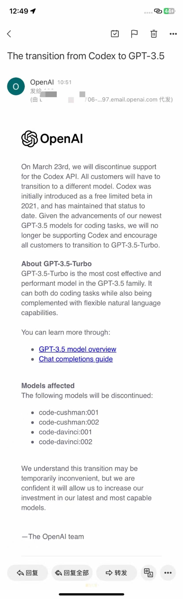
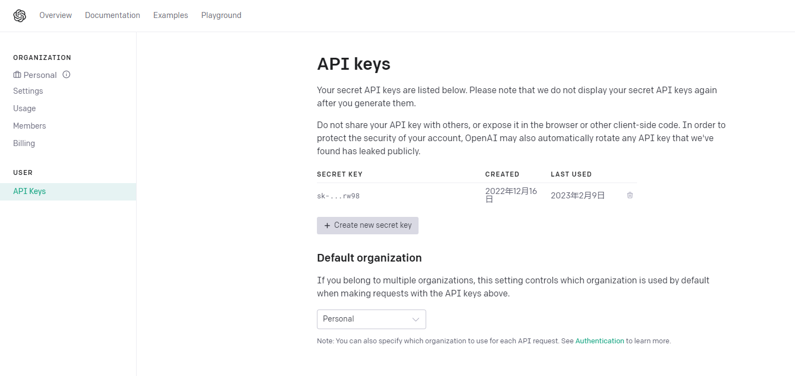

# Access-chatGPT-in-Siri
Siri接入ChatGPT指南。目前仅限iPhone端及其他支持快捷指令的Apple产品，后续会更新Android版本。
如果觉得有用，尽可能的点Star！！！感谢！！

## 通知(也就是说以后不科学就无法使用了)：
目前code-cushman:001、code-cushman:002、code-davinci:001、code-davinci:002已被openAI通知将在不久的将来停用
如图

# 创建账号/登录账号

​第一次使用chatGPT时，先到chatGPT的官网新建账号：

点击“Sign up”进行账号的注册，如果有账号的话则点击“Log in”登录。

可以用大多数的邮箱进行账号的注册，包括但不限于QQ邮箱、163邮箱、google邮箱、教育邮箱等；

如果遇到这种情况，那就代表着chatGPT用户过多，多刷新几次就好了。

登录之后进入这个网站进行API的申领：https://platform.openai.com/account/api-keys

登录账号，点击“Create New Security Key”，进行API key的创建

key只会显示一次，只有一次！！！记得妥善保管！如果key没来得及保存的话，只能重新生成！！key的格式：sk-xxxxxx。最好记录上，以后方便随时调用。

# 下载捷径
# 自3.2起不再进行开源，可以到我的爱发电里进行定制！！！
[点此定制](https://afdian.net/a/Daiyimo/plan)

下面放有快捷指令链接：

1.0 单次问答：
https://www.icloud.com/shortcuts/ddb23c1a0d29406ab82c26cef8621974

1.1 单次问答带QA：
https://www.icloud.com/shortcuts/b7843588bb11435f90e04a992c24e256

2.0 多次连续回答：
https://www.icloud.com/shortcuts/18d3f2621abb424c9bc85a46ede39142

2.1 修复弹窗bug：
https://www.icloud.com/shortcuts/809977bb030f4c9f9ce57a357e3ddf0c

2.2 新增无需手动点击继续对话功能；新增“再见”互动结束语；更新了连续对话显示QA；优化了文本弹窗的问题；优化了格式缩进问题
https://www.icloud.com/shortcuts/cebc3ec416a24a91a60405dd6cdf7708

3.0 已支持openAI的官方接口的AI绘图功能，同一个key！！
https://www.icloud.com/shortcuts/67e9b7ccb15c4bedb4faf6d98f31adec

3.1 同时支持对话和画图的功能，支持语音选择功能，新增API的初步验证，更改默认回答显示QA，并支持对话的连续性（画图功能的对话连续性仍存在一定bug，已在修复）
https://www.icloud.com/shortcuts/ca012c8fd4d14f6babcd4f230e65a495

4.0新增GPT3.5的模型+连续对话！！（国内IP响应慢，优先全局科学！）
[4.0在这](https://afdian.net/a/Daiyimo/plan)

4.1新增GPT4.0的模型+连续对话！！（国内IP响应慢，优先全局科学！）
[4.1在这](https://afdian.net/a/Daiyimo/plan)

没魔法没Key可以玩这个：
https://chat.forchange.cn/

## 由于版本过多，拷贝下来之后要重命名，例如：smart Siri 1.0 ==> smart Siri

把你的key粘贴到如上图所示的位置，注意！是全选替换！

这样就完成啦！

# [开发不易，请杯瑞幸吧](https://afdian.net/a/Daiyimo/plan)

# 使用说明

两种输入方法：

一、“嘿 Siri，smart Siri”，即可打开快捷指令（第一次打开会有权限提醒，一路点是就好）

二、在快捷指令里点开，并在yes！下面的框中输入你的问题即可！

# 补充

发现如下bug：
Siri弹窗超出字符报错；
继续分支可以设为关键词结束；
bug会在下个版本进行修复！！！

部分手机会遇到文本弹窗的情况，请先用Siri语音运行一次Smart Siri，进行第一次问答，一路点允许，直到报错。再次从快捷指令中打开SmartT Siri即可正常使用！！！

目前只支持iPhone的快捷指令，还不知道Android的实现方法，在做了在做了，如有更好的点子欢迎联系我！
# 体验交流群
## 一群已满加二群
## 二群已满加三群
## 三群已满加四群
## 四群已满加五群
## 五群已满加六群
## 六群已满加七群
## 七群已满加八群
## 八群已满加九群
## 九群已满加十群
## 十群已满加十一群
## 最后一个十二群
## 微信十二个群已满，来电报吧！！

[点此加电报](https://t.me/+hp8xEg3PIU0yODA1)
