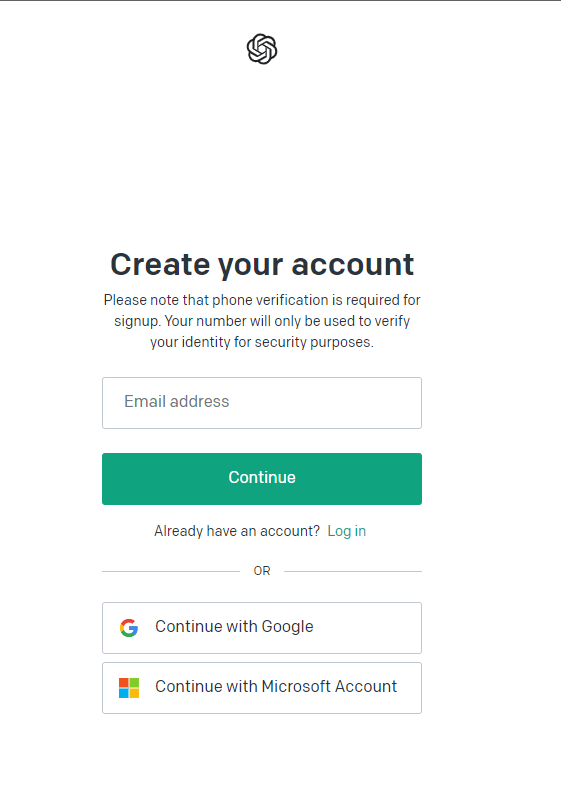
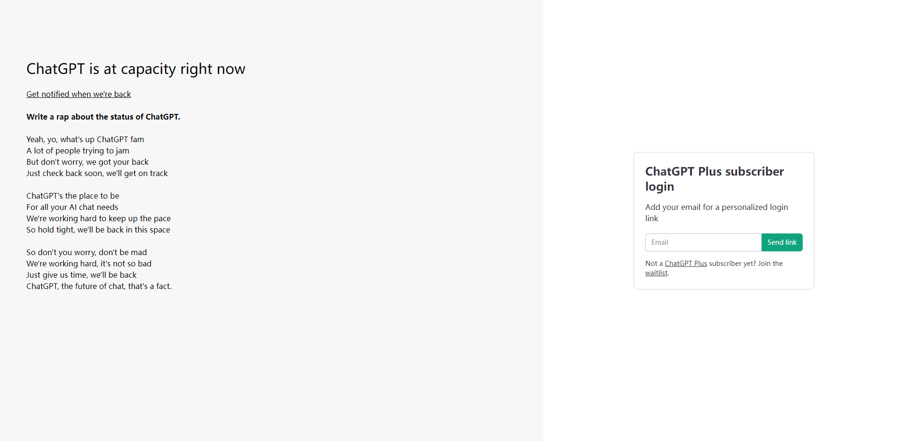
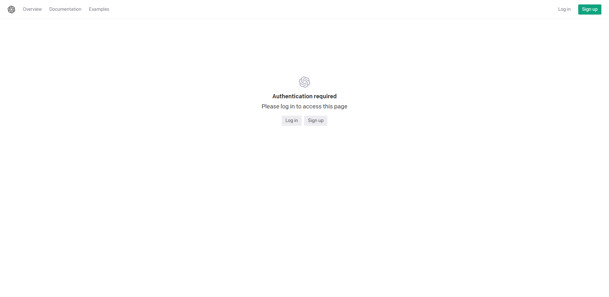
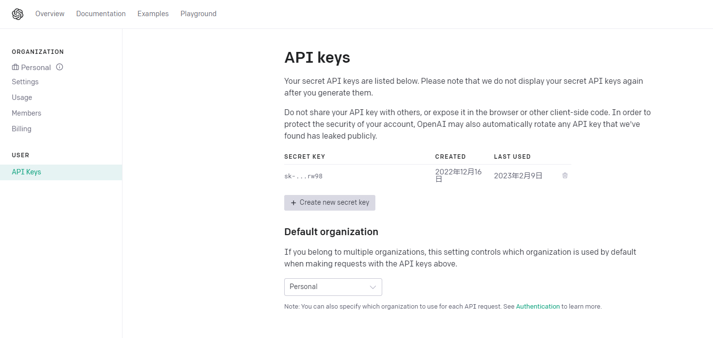
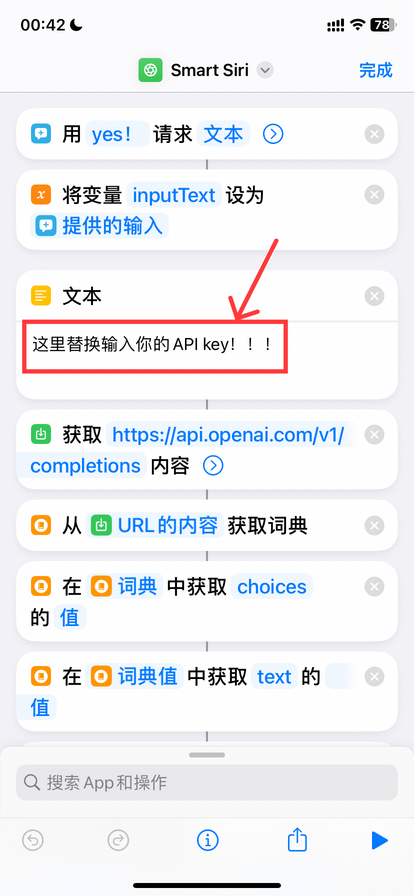

# Access-chatGPT-in-Siri
chatGPT接入Siri指南，目前仅限iPhone端，后续会更新Android

# 创建账号/登录账号

​	第一次使用chatGPT，先到chatGPT的官网新建账号：

点击“sign up”进行账号的注册，如果有账号的话点击“log in”进行登录。

可以用大多数的邮箱进行账号的注册，包括但不限于QQ邮箱、163邮箱、google邮箱、教育邮箱等；

如果遇到这种情况，那就代表着chatGPT用户过多，多刷新几次就好了

登录之后进入这个网站进行API的申领：https://platform.openai.com/account/api-keys

登录账号，点击“Create New Security Key”，进行API key的创建

key只会显示一次，只有一次！！！记得妥善保管！如果key没来得及保存的话，只能重新生成！！key的格式：sk-xxxxxx。最好记录上，以后方便随时调用。

# 下载捷径

下放有iPhone的快捷指令链接：

1.0 单次问答：
https://www.icloud.com/shortcuts/ddb23c1a0d29406ab82c26cef8621974

1.1 单次问答带QA：
https://www.icloud.com/shortcuts/b7843588bb11435f90e04a992c24e256

2.0 多次连续回答：
https://www.icloud.com/shortcuts/18d3f2621abb424c9bc85a46ede39142

## 由于版本过多，拷贝下来之后要重命名，例如：smart Siri 1.0 ==> smart Siri

把你的key粘贴到如上图所示的位置，注意！是全选替换！

这样就完成啦！

# 使用说明

两种输入方法：

一、“嘿 Siri，smart Siri”，即可打开快捷指令（第一次打开会有权限提醒，一路点是就好）

二、在快捷指令里点开，并在yes！下面的框中输入你的问题即可！

# 补充

目前能力有限，仅能单次对话，后续会改进！

目前只支持iPhone的快捷指令，还不知道Android，在做了在做了，如有更好的点子欢迎联系我！
## 体验交流群

# 一群已满加二群

